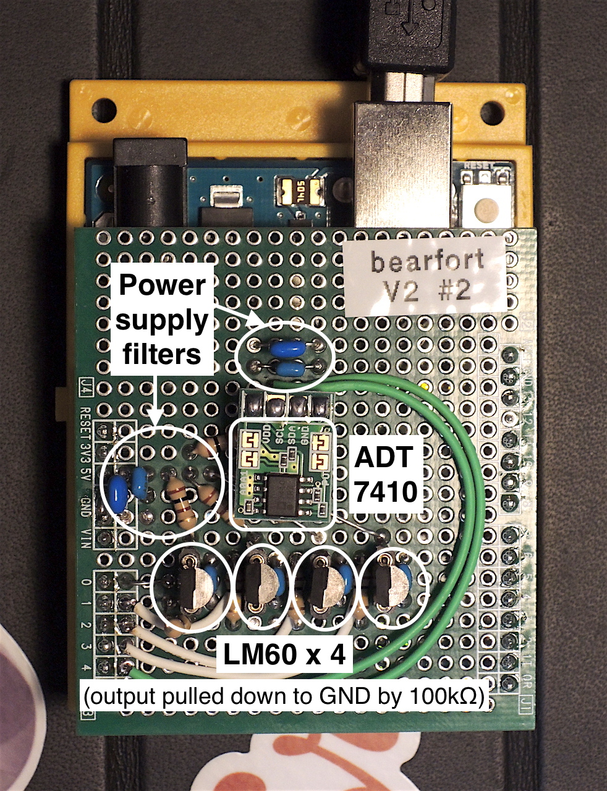
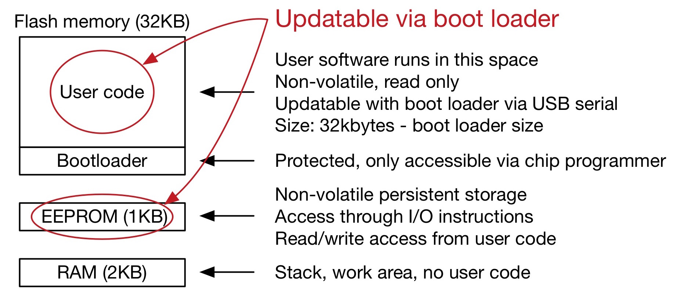

footer: Kenji Rikitake / Erlang Factory SF Bay 2016
slidenumbers: true

# Fault-tolerant Sensor Nodes with Erlang/OTP and Arduino 

<!-- Use Deckset 1.6.0, Next theme, 16:9 aspect ratio -->
<!-- target: 30 slides -->

^ Good afternoon!

---

# Kenji Rikitake

10-MAR-2016
Erlang Factory SF Bay 2016
San Francisco, CA, USA
@jj1bdx

Erlang Factory SF Bay 2010-2016 speaker (7th year!)

Program Committee Member of ACM Erlang Workshop (2011, 2013, 2016) and CUFP 2016


^ My name is Kenji Rikitake. This is my seventh talk on Erlang Factory in San Francisco.

---

# Basic principles

## Stabilize
## Simplify
## "Let It Crash"
## Update dynamically

^ The basic principles on building fault tolerant systems are: keeping systems stabilized and simple for robustness. Don't be afraid of resetting or restarting the system. In other words, Let It Crash. The system should be able to be dynamically updated on demand, for minimizing the downtime.

---

# In this talk

## Bearfort sensor shield
## 8-bit Arduino basics
## Wire protocols
## How Erlang talks with Arduino

^ In this talk, I will explain the Bearfort system and sensors, a redundant temperature sensor system for Erlang/OTP. I will also talk about the basic design principles, including 8-bit Arduino basics, the wire protocols, and how Erlang can talk with Arduino.


---


# Bearfort[^1] system diagram


^ This is the diagram of Bearfort system. Each sensor, which is an Arduino shield, is made of 4 analog temperature sensors, LM60, and one digital temperature sensor, ADT7410. Each sensor is connected to BEAM host through USB serial links.

[^1]: Bearfort = {BEam, ARduino, FORTified} / Bearfort ridge, NJ, USA / Background photo: By Zeete - Own work, CC BY-SA 4.0, <https://commons.wikimedia.org/w/index.php?curid=38798143>

---

# Bearfort sensor shield

## Temperature sensors
## Analog Devices ADT7410 on TWI/I2C
## 4 x Texas Instruments LM60s on ADC0-3

All sensors are powered by +5V
All sensors are replaceable


^ This is the picture of Bearfort sensor shield. I made it by hand, soldered by myself.


---

# What Bearfort shield can do?

## Fault tolerant temperature sensing
## 5 sensors
## Robust against sensor failures



^ The top small board is the digital temperature sensor, and the bottom four transistor-like chips are the analog sensors. All sensors are operating independently.

---

# Arduino Uno R3

## Atmel AVR ATmega328P
## Powered by USB (5V) or external power supply (7~12V)
## 4 Analog Input + I2C + SPI

Price: USD24.95[^2] as of March 2016 at SparkFun Electronics

[^2]: Photo: [Wikimedia Commons](https://commons.wikimedia.org/wiki/File:Arduino_Uno_006.jpg), By oomlout - ARDU-UNO-03-Front, CC BY-SA 2.0, <https://commons.wikimedia.org/w/index.php?curid=40551883>


^ This is a picture of Arduino Uno R3. It's basically an AVR chip ATmega328p, with the power supply, USB serial interface, and external connectors. This small board is convenient for prototyping hardware development.

---

# [fit] AVR development

## Write C event loop
## Try and error
## Interrupts are for timer only

^ I'd like to talk about AVR development. The main toolchains for 8-bit AVRs are like the one in old MS-DOS days: GNU C compiler, assembler, program loader, and the library. You usually use interrupts for timers only; and lots of try-and-error attempts are needed.

---

# Chip programmer

## Essential for writing boot loader firmware
## Hardware diagnostics
## Hardware protection bit configuration
## Replicating chips

Photo: [AVR Dragon](http://www.atmel.com/tools/AVRDRAGON.aspx), circa 2008


^ Using a chip programmer is essential to debug the firmware. This is a picture of AVR Dragon, an USB programmer. It can perform all necessary hardware configuration, from the protection bit configuration, to replicating the chips.

---

# Hardware principles

## Stabilize
## Simplify
## "Let It Crash"

^ Now I'd like to talk about the principles on developing hardware for fault tolerant systems. First you need to make a stable hardware, and keep it simple. The hardware should be capable to reset when something goes wrong.

---

# Stabilize hardware

## Solder (no breadboard)
## Less contact points
## Prepare for contact failures

^ I see a lot of examples for Arduino made on breadboards, but the contact pins and wires are fragile. I suggest soldering instead. Keeping the contact points minimum is also essential to prevent contact failures, though they will eventually happen, so you also need to prepare.

---

# Contact failures

## Open circuit
## Short circuit

^ There are briefly two kinds of contact failures: open circuit, and short circuit. Open circuit means losing contact. Short circuit means two independent points are accidentally connected. Both cases may cause hardware malfunction.

---

# Open circuit


^ When two contacts are disconnected, the signal won't get through, and the circuit expecting the signal may receive an undefined state. For Bearfort shield, all analog sensor inputs are pulled down to the ground by resistors, so that the disconnection can be detected without halting the CPU.

---

# LM60 open circuit failure


^ When an open contact failure occurs, the failure is hard to detect. The signal level observed by open inputs could be rapidly changing, or rather slowly changing as if the value are legitimate, which are not. Pulling down to the ground level prevents this confusion. 

---

# Short circuit


^ When a digital signal line accidentally makes a short circuit to the ground, signal transfer is no longer possible. In this example, the essential clock between the sensor and CPU cannot be transmitted by the short circuit, which may halt the system altogether. 

---

# Simplify hardware

## Keep firmware small
## Return raw sensor values
## Leave no tunable parts

^ Another principle on hardware design is to keep it simple. Don't try to do many things; AVR is slow, so keep the firmware code small. Let the output values be processed by host, so return the raw values. Also, tunable hardware parts such as variable resistors may easily fail, so don't use them if possible.


---

# "Let It Crash"

## Reset when hardware fails
## Allow external reset
## Use watchdog timer if needed

^ Let It Crash on Erlang is easy, but on hardware, you should be able to reset it. Allowing external reset is required for restarting from Erlang. Use the watchdog timer to minimize the hardware halt detection for the mission-critical systems.

---

# Resetting Arduino from USB

## [fit] Turn off DTR/RTS for 50msec and turn back on

```erlang
%%% Using Michael Santos'
%%% stk500 and srly repository code
{ok,FD} = serctl:open("/dev/cu.usbmodem1D11311"),
[begin dtrrts(FD, Status),
    timer:sleep(50) end || Status <- [off, on] ].
```

## Yes, that's it!

^ 

---

# Software principles

## Simplify
## "Let It Crash"
## Dynamic update

---

# [fit] Simplify wire protocol

## Polling from host
## Fixed-length output
## No tunable parts

---

# Serial line protocol

## [fit] No frame: synchronization needed
## Fixed length = pattern matching
## No tuning = idempotent

---

# Serial line control from Erlang/OTP

## Michael Santos' [srly](https://github.com/msantos/srly) package
## TTY control (ioctl())
## Fixed-length reading function is *extremely* useful

---

# Wire protocol message format

## 16-byte fixed length


---

# Wire protocol in Erlang

```erlang
{ok, <<2, 16#51, 16#82,  % 2 == STX
 DevId:2/little-unsigned-integer-unit:8,
 ADT0:2/little-signed-integer-unit:8,
 A0:2/little-unsigned-integer-unit:8,
 A1:2/little-unsigned-integer-unit:8,
 A2:2/little-unsigned-integer-unit:8,
 A3:2/little-unsigned-integer-unit:8,
 3>>} = read_serial(FD). % 3 == ETX
```

---

# "Let It Crash"

## Erlang does it *very well*
## Hardware reset control
## Serial ioctl-capable API

---

# Update dynamically

## Updating Arduino from Erlang
## Use boot loader for code loading
## Slow (5~10 seconds) but feasible

---

# [fit] ATmega328p memory model



---

# Update example

```erlang
update() ->
    Hex = stk500:hex_file(
          "./arduino-uno/bearfort-arduino.hex"),
    Bytes = stk500:chunk(Hex, 128),
    {ok,FD} = stk500:open(
               "/dev/cu.usbmodem1D11311",
               [{speed, b115200}]),
    ok = stk500:load(FD, Bytes).
```
---

# Issues

## Slow USB connection transition
## Automated sensor calibration
## Modeling fault tolerant operation

---

# Future directions

## Indoor/outdoor field testing
## Embedded Erlang node
## Multiple sensors/nodes

---

# Excluded from this talk

* TCP/IP: MQTT, CoAP, etc.
* Cryptographic security
* Host OS device drivers
* non-8bit Arduino boards
* Erlang/ALE = for Raspeberry Pi

---

# Related work (1/2)

* [Code and slides of this presentation](https://github.com/jj1bdx/bearfort/)
* [srly](https://github.com/msantos/srly): Erlang NIF serial API
* [stk500](https://github.com/msantos/stk500): Erlang AVR boot loader API
* [avr-libc](http://savannah.nongnu.org/projects/avr-libc/), avr-binutils, avr-gcc
* [avrdude](http://savannah.nongnu.org/projects/avrdude): AVR program loader
* [optiboot](https://github.com/optiboot/optiboot/): AVR boot loader firmware 

---

# Related work (2/2)

* [Omer Kiric's talk on EF SF Bay 2013](http://www.erlang-factory.com/conference/ErlangUserConference2013/speakers/OmerKilic)
   * [Erlang/ALE on GitHub](https://github.com/esl/erlang_ale)
* [Frank Hunleth's talk on EF SF Bay 2015](http://www.erlang-factory.com/sfbay2015/frank-hunleth)
   * Robot running in Elixir
   * [elixirbot on GitHub](https://github.com/fhunleth/elixirbot)

---

# Thanks to:

## Michael Santos
## Erlang Solutions
## ...and you all!

---

# [fit] Thank you

# [fit] Questions?
