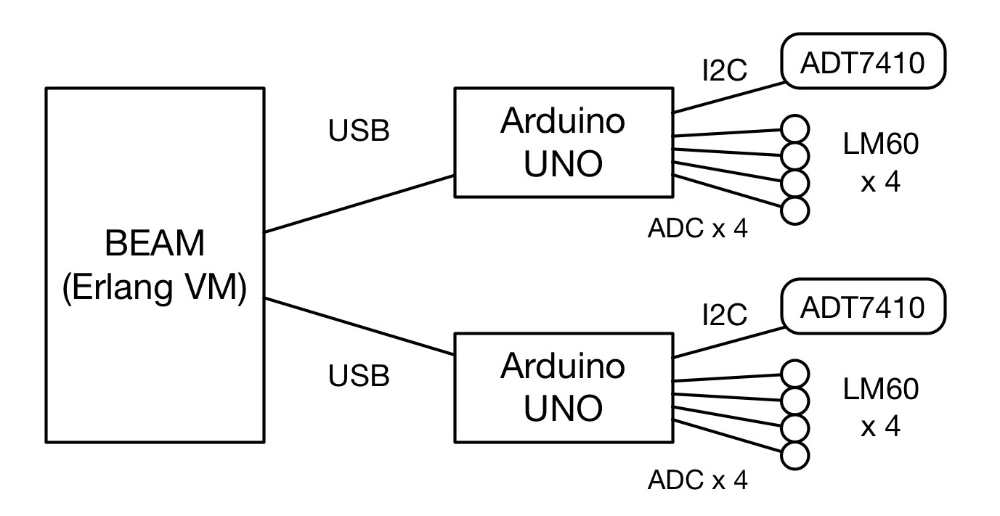
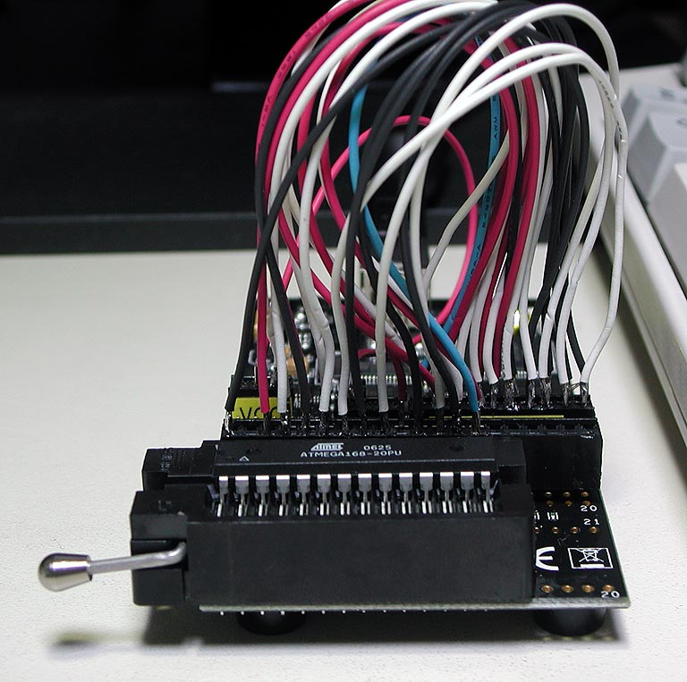
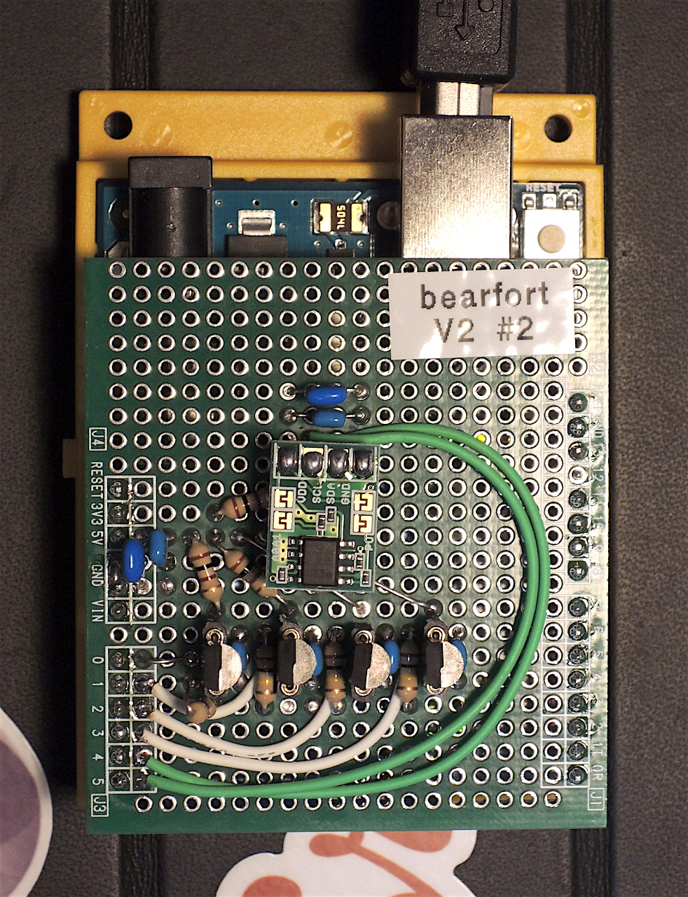
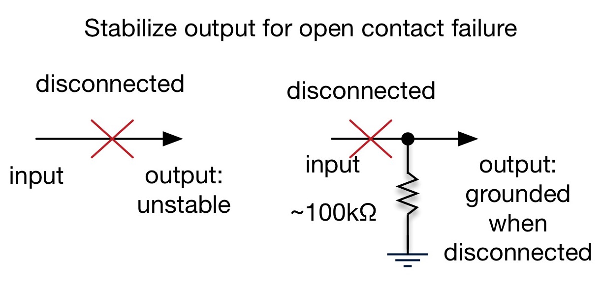
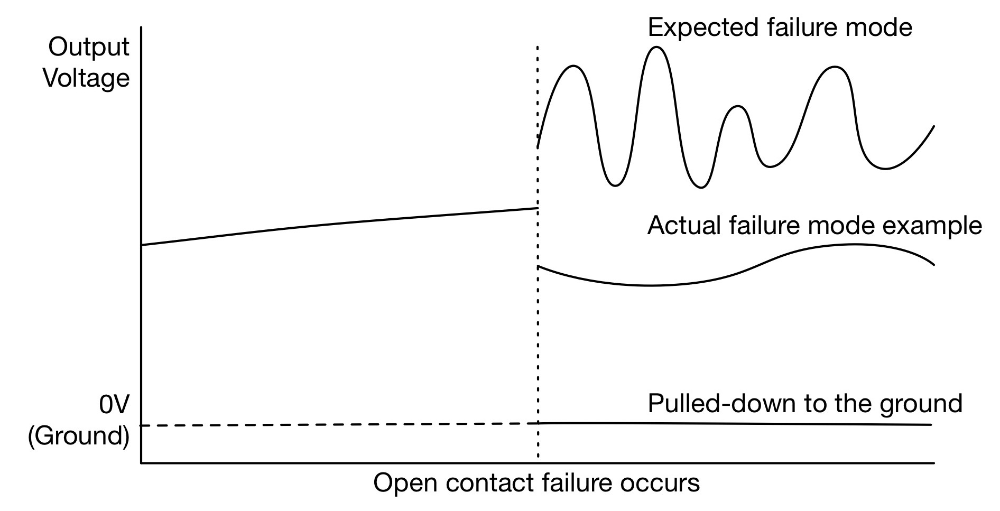
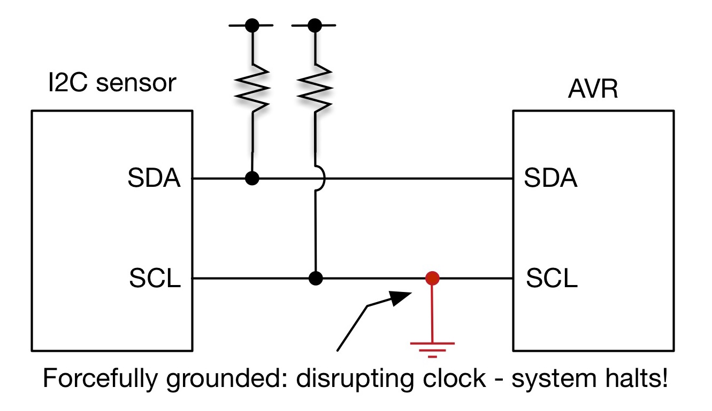
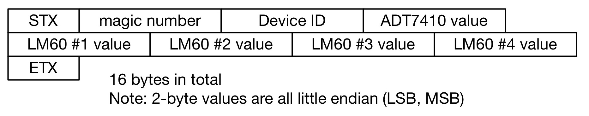

footer: Kenji Rikitake / Erlang Factory SF Bay 2016
slidenumbers: true

# Fault-tolerant Sensor Nodes with Erlang/OTP and Arduino 

<!-- Use Deckset 1.6.0, Next theme, 16:9 aspect ratio -->
<!-- target: 30 slides -->

---

# Kenji Rikitake

10-MAR-2016
Erlang Factory SF Bay 2016
San Francisco, CA, USA
@jj1bdx

Erlang Factory SF Bay 2010-2016 speaker (7th year!)

Program Committee Member of ACM Erlang Workshop (2011, 2013, 2016) and CUFP 2016


---

# Basic principles

## Stabilize
## Simplify
## "Let It Crash"
## Dynamic Update

---

# In this talk

## Bearfort sensor shield
## 8-bit Arduino basics
## Wire protocols
## How Erlang talks with Arduino

---


# Bearfort[^1] system diagram




[^1]: Bearfort = {BEam, ARduino, FORTified} / Bearfort ridge, NJ, USA / Background photo: By Zeete - Own work, CC BY-SA 4.0, <https://commons.wikimedia.org/w/index.php?curid=38798143>

---

# Arduino Uno R3

## Atmel AVR ATmega328P
## Powered by USB (5V) or external power supply (7~12V)
## 4 Analog Input + I2C + SPI

Price: USD24.95[^2] as of March 2016 at SparkFun Electronics

[^2]: Photo: [Wikimedia Commons](https://commons.wikimedia.org/wiki/File:Arduino_Uno_006.jpg), By oomlout - ARDU-UNO-03-Front, CC BY-SA 2.0, <https://commons.wikimedia.org/w/index.php?curid=40551883>


---

# [fit] AVR development

## Write C(++) and assembler
## Event loop
## Try and error
## Interrupts: timer only

---

# Chip programmer

## Essential for writing bootloader firmware
## Hardware diagnostics
## Hardware protection bit configuration
## Replicating chips

Photo: [AVR Dragon](http://www.atmel.com/tools/AVRDRAGON.aspx), circa 2008



---

# Hardware principles

## Stabilize
## Simplify
## "Let It Crash"

---

# Stabilize hardware

## Solder - do not use breadboards
## Prepare for contact failures
## KISS - "Keep it simple and stupid"

---

# Bearfort sensor shield

## Temperature sensors
## Analog Devices ADT7410 on TWI/I2C
## 4 x Texas Instruments LM60s on ADC0-3

All sensors are powered by +5V
All sensors are replaceable



---

# Contact failure modes

## Open circuit
## Short circuit
## Intermittent failures

---

# Open circuit



---

# LM60 open circuit failure



---

# Short circuit



---

# Simplify hardware

## 8bit AVR is slow (16MHz)
## Output raw sensor values only
## No tunable parts

---

# "Let It Crash"

## Reset when hardware fails
## Allow external reset
## Use watchdog timer if needed

---

# Resetting Arduino from USB

* (diagram of reset sequence)

---

# Software principles

## Simplify
## "Let It Crash"
## Dynamic update

---

# Simplify wire protocol

## Polling from host
## Fixed-length output
## No tunable parts

---

# Serial line control from Erlang/OTP

## Michael Santos' [srly](https://github.com/msantos/srly) package
## [fit] Control tty line principles with ioctl()
## Fixed-length reading function is *extremely* useful

---

# Wire protocol message format

## 16-byte fixed length



---

# Wire protocol in Erlang

```erlang
{ok, <<2, 16#51, 16#82,  % 2 == STX
 DevId:2/little-unsigned-integer-unit:8,
 ADT0:2/little-signed-integer-unit:8,
 A0:2/little-unsigned-integer-unit:8,
 A1:2/little-unsigned-integer-unit:8,
 A2:2/little-unsigned-integer-unit:8,
 A3:2/little-unsigned-integer-unit:8,
 3>>} = read_serial(FD). % 3 == ETX
```

---

# "Let It Crash"

## Erlang does it *very well*
## Hardware reset control
## Serial ioctl-capable API
## Idempotent code

---

# Dynamic update

## Updating Arduino from Erlang
## Use bootloader for code loading
## Slow (5~10 seconds) but feasible

---

# Update example

```erlang
update() ->
    Hex = stk500:hex_file(
          "./arduino-uno/bearfort-arduino.hex"),
    Bytes = stk500:chunk(Hex, 128),
    {ok,FD} = stk500:open(
               "/dev/cu.usbmodem1D11311",
               [{speed, b115200}]),
    ok = stk500:load(FD, Bytes).
```
---

# Issues

## Slow USB connection transition
## Automated sensor calibration
## Modeling fault tolerant operation

---

# Future directions:

## Indoor/outdoor field testing
## Embedded Erlang node
## Multiple sensors/nodes

---

# Excluded from this talk

* TCP/IP: MQTT, CoAP, etc.
* Cryptographic security
* Host OS device drivers
* non-8bit Arduino boards
* Erlang/ALE = for Raspeberry Pi

---

# Related work (1/2)

* [Code and slides of this presentation](https://github.com/jj1bdx/bearfort/)
* [srly](https://github.com/msantos/srly): Erlang NIF serial API
* [stk500](https://github.com/msantos/stk500): Erlang AVR bootloader API
* [avr-libc](http://savannah.nongnu.org/projects/avr-libc/), avr-binutils, avr-gcc
* [avrdude](http://savannah.nongnu.org/projects/avrdude): AVR program loader
* [optiboot](https://github.com/optiboot/optiboot/): AVR bootloader firmware 

---

# Related work (2/2)

* [Omer Kiric's talk on EF SF Bay 2013](http://www.erlang-factory.com/conference/ErlangUserConference2013/speakers/OmerKilic)
   * [Erlang/ALE on GitHub](https://github.com/esl/erlang_ale)
* [Frank Hunleth's talk on EF SF Bay 2015](http://www.erlang-factory.com/sfbay2015/frank-hunleth)
   * Robot running in Elixir
   * [elixirbot on GitHub](https://github.com/fhunleth/elixirbot)

---

# Thanks to:

## Michael Santos
## Erlang Solutions
## ...and you all!

---

# [fit] Thank you

# [fit] Questions?
