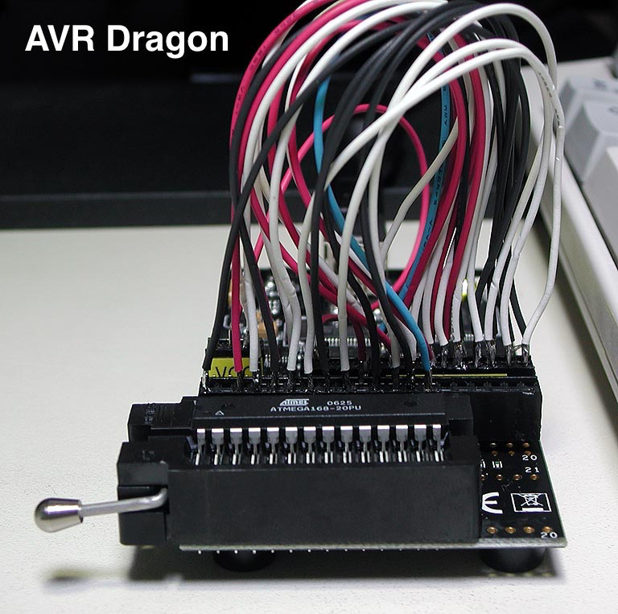

footer: Kenji Rikitake / Erlang Factory SF Bay 2016
slidenumbers: true

# [fit] Fault-tolerant Sensor Nodes
# [fit] with Erlang/OTP and Arduino 

<!-- Use Deckset 1.6.0, Zurich theme, 16:9 aspect ratio -->
<!-- target: 30 slides -->

---

# Kenji Rikitake

10-MAR-2016
Erlang Factory SF Bay 2016
San Francisco, CA, USA
@jj1bdx

Professional Internet Engineer

Erlang Factory SF Bay 2010-2016 speaker (for *seven* consecutive years!)

---

# Executive summary

* IoT is a buzzword: *back to basics*
* Designing fault-tolerant systems is *hard*: a practical way is giving more redundancy
* Devices/components *fail*
* Abstraction in Erlang helps a lot

---

# NOT in this talk

* Protocols over TCP/IP: MQTT, CoAP
* Cryptographic security
* Host OS device drivers
* non-8bit Arduino boards
* Erlang/ALE (good for directly connecting devices to Raspberry Pi, but not for Arduino)

---

# In this talk

* Bearfort system design
* Sensor and 8-bit Arduino basics
* Mounting redundant sensors on Arduino
* Protocols on the wire
* How Erlang talks with Arduino
* Functional abstraction with Erlang

---

# Bearfort[^1] system diagram

* (diagram of Internet-BEAM-Arduino-Sensors)

[^1]: Bearfort = {BEam, ARduino, FORTified} / Bearfort ridge, NJ, USA

---

# Arduino Uno R3

* Atmel AVR ATmega328P
* 16MHz clock
* 32K Flash (program only)
* 2K RAM, 1K EEPROM
* Powered by USB (5V) or external power supply (7~12V)
* 4 Analog Input + I2C + SPI
* USB Serial I/F by ATmega16U2
* USD24.95[^1] as of March 2016

[^1]: Photo: [Wikimedia Commons](https://commons.wikimedia.org/wiki/File:Arduino_Uno_006.jpg), License: CC-BY-SA-2.0

---

# Software development on Arduino

* Easy way: Arduino IDE (not in this talk)
* More pragmatic way: 8bit AVR dev tools
  * [avr-libc](http://savannah.nongnu.org/projects/avr-libc/), avr-binutils, avr-gcc
* Program loader: [avrdude](http://savannah.nongnu.org/projects/avrdude)
* Boot loader: [optiboot](https://github.com/optiboot/optiboot/) 
  * [My fork for EEPROM read/write](https://github.com/jj1bdx/optiboot/)
* In-circuit debuggers/chip programmers: [AVR Dragon](http://www.atmel.com/tools/AVRDRAGON.aspx), STK500, AVRISP mkII

---

# AVR chip programmers[^1]

* Controllable from avrdude
* Chip diagnostics
* High-voltage parallel programming
* Required to write boot loaders
* Required to write fuse bits
* Other hardware debugging

[^1]: Photo: AVR Dragon configured for ATmega168/328p with a zero-pressure DIP socket, by Kenji Rikitake, circa January 2008

---

# Bearfort sensor shield

* Five temperature sensors
* Four TI LM60s on ATmega328p ADC0-3
    * Output fault protection (100kohm to GND)
* One Analog Devices ADT7410 on ATmega328p TWI(I2C)
* All sensors are 5V powered
* All sensors are replaceable

---

# Future directions and issues

* Field test in the outdoor environment
* 
* 

---

# Thanks  Questions?
