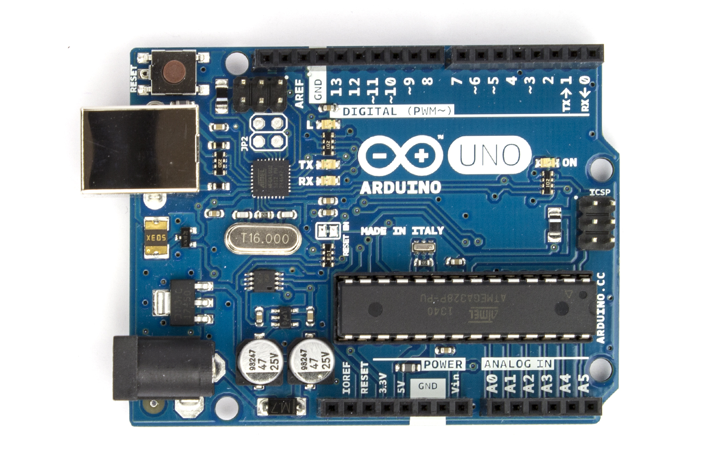

footer: Kenji Rikitake / Erlang Factory SF Bay 2016
slidenumbers: true

# Fault-tolerant Sensor Nodes with Erlang/OTP and Arduino 

<!-- Use Deckset 1.6.0, Zurich theme, 16:9 aspect ratio -->
<!-- target: 30 slides -->

---

# Kenji Rikitake

10-MAR-2016
Erlang Factory SF Bay 2016
San Francisco, CA, USA
@jj1bdx

Professional Internet Engineer

Erlang Factory SF Bay 2010-2016 speaker (for *seven* consecutive years!)

---

# Executive summary

* IoT is a buzzword: *back to basics*
* Designing fault-tolerant systems is *hard*: a practical way is giving more redundancy
* Devices/components *fail*
* Abstraction in Erlang helps a lot

---

# NOT in this talk (= ask other people)

* Protocols over TCP/IP: MQTT, CoAP
* Cryptographic security
* Host OS device drivers
* non-8bit Arduino boards
* Erlang/ALE (good for directly connecting devices to Raspberry Pi, but not for Arduino)

---

# In this talk

* Bearfort system design
* Sensor and 8-bit Arduino basics
* Mounting redundant sensors on Arduino
* Protocols on the wire
* Software development on Arduino
* How Erlang talks with Arduino
* Functional abstraction with Erlang

---

# Bearfort system diagram

* (Internet-BEAM-Arduino-Sensors)
* (Bearfort: BEam, ARduino, FORTified)
* (Bearfort ridge, NJ, USA)

---

# Arduino Uno R3

* ATmel AVR ATmega328P
* 16MHz clock
* 32K Flash, 2K RAM, 1K EEPROM
* 5V powered by USB or external power supply (7~12V)
* 4 Analog Input + I2C + SPI
* USB HID I/F by ATmega16U2
* USD24.95[^1] as of March 2016

[^1]: Photo: [Wikimedia Commons](https://commons.wikimedia.org/wiki/File:Arduino_Uno_006.jpg), License: CC-BY-SA-2.0

---

# Future directions and issues

* Field test in the outdoor environment
* 
* 

---

# Thanks  Questions?
